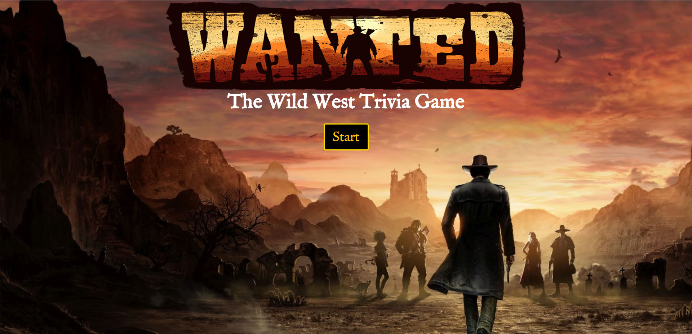
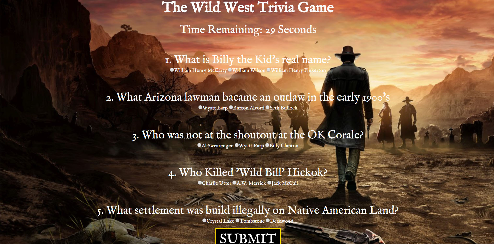
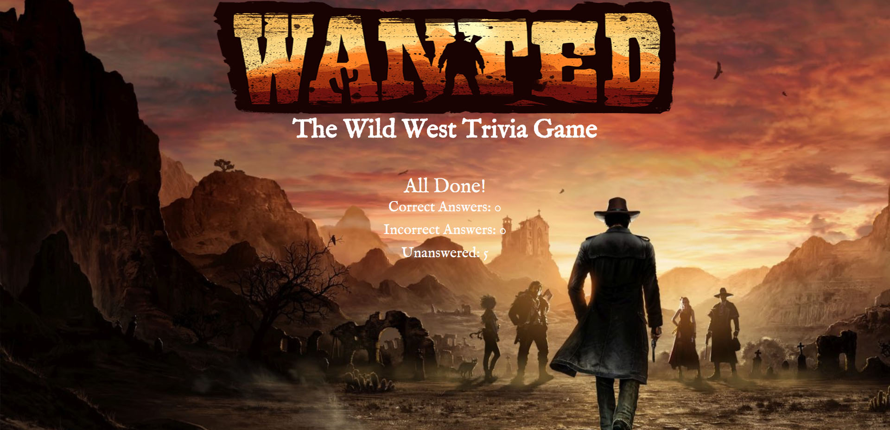

# Wanted! The Wild West Trivia Game

<h2>Play WANTED! The Wild West Trivia Game: <a href="https://cjsummers003.github.io/TriviaGame">https://cjsummers003.github.io/TriviaGame</a> </h2>

<ul>
    <li><h2>The player will start the game simply by click the start button</h2></li>
    
    <li><h2>The player will then have 45 second to answer 5 question about the Wild West.</h2></li>
    
    <li><h2>After the player finishes answering the question and presses the submit button, their score will be displayed.</h2></li>
    <li><h2>The player will see how many questions they have answered correctly, incorrectly and question they did not answer.</h2></li>
     
</ul>

<h2>External Resources Used</h2>
<ul>
<li><h4>Google Fonts</h4></li>
<li><h4>Bootstrap</h4></li>
<li><h4>JQuery</h4></li>
</ul>

  
 <h2>Author</h2>
 <h3>CJ Summers - HTML/CSS/JavaScript</h3>

 
